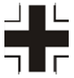

# Steel Division 2

## Übersicht Divisionen

### AXIS

&nbsp;

#### *S-Tier*

```{list-table}
:header-rows: 1

* - Division
  - Wappen
  - Stärken / Schwächen
  - Anmerkungen
* - [17. SS Panzergrenadier](https://steeldivision.fandom.com/wiki/17._SS-Panzergrenadier_(SD2))
  - 
  - - <span style="color:green">Sehr stark durch die Bank</span>  
    &nbsp;
    - <span style="color:red">Im Grunde keine Schwäche</span>  
  -
* - [4. Fallschirmjäger](https://steeldivision.fandom.com/wiki/4._Fallschirmj%C3%A4ger)
  - 
  - - <span style="color:green">Sehr starke Infanterie</span>  
    - <span style="color:green">Stark in allen Tabs</span>  
    - <span style="color:green">Sehr viel 2k</span>  
    - <span style="color:green">Sehr gute Recon und Flugzeuge</span>  
    &nbsp;
    - <span style="color:red">Teure Einheiten</span>  
  - - **LG40**: Ist keine LG42, nicht benutzen
    &nbsp;
    - **Bf 110 G-4b/R3 (M1/M5)**: Sehr guter AT-Jäger
    &nbsp;
    - **Z.1007ter serie XIII ALCIONE**: Schwerer Bomber mit Widerstand 'Sehr Gut'
    &nbsp;
    - Taktik: Viel mit Flugzeugen schon ab A arbeiten  
```

&nbsp;

#### *A-Tier*

```{list-table}
:header-rows: 1

* - Division
  - Wappen
  - Stärken / Schwächen
  - Anmerkungen
* - [Panzerdivision Tatra](https://steeldivision.fandom.com/wiki/Panzerdivision_Tatra)
  - 
  - - <span style="color:green">Starkes Anti-Tank</span>  
    - <span style="color:green">Guter Infanterie Mix</span>  
    - <span style="color:green">Viele leichte Panzer + SPW</span>  
    &nbsp;
    - <span style="color:red">Schwächere Anti-Air</span>  
    - <span style="color:red">Mittelmässige Flugzeuge</span>  
  - - **LG40**: Ist keine LG42, nicht benutzen
    &nbsp;
    - **He 111 H-21**: Brauchbar gegen Panzer
    &nbsp;
    - Taktik: Infantrie Spam
    &nbsp;
    - Taktik: Light/Medium Tank Spam
```


&nbsp;


### ALLIES

#### *S-Tier*

```{list-table}
:header-rows: 1

* - Division
  - Wappen
  - Stärken / Schwächen
  - Anmerkungen
* - [C.I.A.B.G.](https://steeldivision.fandom.com/wiki/C.I.A.B.G.)
  - 
  - - <span style="color:green">Günstige Infanterie</span>  
    - <span style="color:green">Starke Panzer</span>  
    - <span style="color:green">Sehr gute Artillerie</span>  
    - <span style="color:green">Gute Flugzeuge</span>  
    - <span style="color:green">Günstige Infanterie</span>  
    &nbsp;
    - <span style="color:red">Wenig CQC</span>  
  - - **Typhoon Mk Ib**: Beste AT Rocket Flugzeug im Spiel  
    &nbsp;
    - **17-PDR 76.2mm**: sehr gutes AT Geschütz (2 Karten)  
    &nbsp;
    - **Zeniste**: Sehr gute CQC (4 Thompson + Flamer)  
* - [2nd Infantry](https://steeldivision.fandom.com/wiki/2nd_Infantry)
  - 
  - - <span style="color:green">Extrem gute Artillerie</span>  
    - <span style="color:green">Sehr gute Flugzeuge</span>  
    - <span style="color:green">Semi-Automatic Rifles</span>  
    - <span style="color:green">Gute 2k</span>  
  -
* - [1st Special Brigade](https://steeldivision.fandom.com/wiki/1st_Special_Service_Brigade)
  - 
  - - <span style="color:green">Sehr gute Infanterie</span>  
    - <span style="color:green">Sehr gute Anti-Air</span>  
    - <span style="color:green">Extrem starke Off-Map</span>  
    - <span style="color:green">Sehr schnelle Division</span>  
    &nbsp;
    - <span style="color:red">Extrem Phase-Locked Anti-Tank</span>  
    - <span style="color:red">Mittelmässige Artillerie</span>  
  - - Sehr viele **Hellcat I** Cards bei Flugzeugen  
    &nbsp;
    - Sehr viele **Shermans**  
    &nbsp;
    - **Commando No4**: Mit die beste CQC im Spiel  
    &nbsp;
    - **Commando No6**: Sehr gutes Rifle Squad mit Sniper  
* - [1st Airborne TaskForce](https://steeldivision.fandom.com/wiki/1st_Airborne_Task_Force)
  - 
  - - <span style="color:green">Viel sehr gute Infanterie + Recon</span>  
    - <span style="color:green">Sehr gute Luftwaffe</span>  
    &nbsp;
    - <span style="color:red">Deck hat keine Tiefe, d.h. wird wohl nicht 'Balanced' gespielt werden</span>  
    - <span style="color:red">Schlechte Anti-Air, keine AA in Phase A</span>  
    - <span style="color:red">Mittelmäßige Artillerie</span>  
  - - **Forceman**: sehr starke CQC/Mid-Range Infanterie  
    &nbsp;
    - **Beaufighter Mk X**: starkes AT Flugzeug  
    &nbsp;
    - Taktik: Häuserkampf/Nahkampf suchen  
    &nbsp;
    - Taktik: Kampf im offenen Gelände vermeiden  
```

&nbsp;

#### *A-Tier*

```{list-table}
:header-rows: 1

* - Division
  - Wappen
  - Stärken / Schwächen
  - Anmerkungen
* - [84-ya Gvard. Strelkovy](https://steeldivision.fandom.com/wiki/84-ya_Gvard._Strelkovy)  
  - 
  - - <span style="color:green">Sehr starke Armor</span>  
    - <span style="color:green">Stark in allen Tabs</span>  
  - - Beste sowjetische Division
```
