# Übersicht Divisionen

&rarr; <span style="color:red">Nach Einschätzung AtkPwr Gaming (17.09.2023).</span>    

&nbsp;

```{important}
Einschätzung bezieht sich auf 'Schnelles Spiel' auf zufälligen Karten.  
D.h. **je besser die Division geranked, desto universeller ist sie**.
```

&nbsp;

## AXIS

&nbsp;

### *S-Tier*

```{list-table}
:header-rows: 1

* - Division
  - Wappen
  - Stärken / Schwächen
  - Anmerkungen
* - [17. SS Panzergrenadier](https://steeldivision.fandom.com/wiki/17._SS-Panzergrenadier_(SD2))
  - 
  - - <span style="color:green">Sehr stark durch die Bank</span>  
    &nbsp;
    - <span style="color:red">Im Grunde keine Schwäche</span>  
  - - <span style="color:DodgerBlue">**Stug IV**: Bester Medium Tank im Spiel</span>
    - **SS Legionari**: Sehr starke CQC (4xBeretta+4xG43+Panzerfaust+Molotov; Fanatisch) (2 Karten)
* - [4. Fallschirmjäger](https://steeldivision.fandom.com/wiki/4._Fallschirmj%C3%A4ger)
  - 
  - - <span style="color:green">Sehr starke Infanterie</span>  
    - <span style="color:green">Stark in allen Tabs</span>  
    - <span style="color:green">Sehr viel 2k</span>  
    - <span style="color:green">Sehr gute Recon und Flugzeuge</span>  
    &nbsp;
    - <span style="color:red">Teure Einheiten</span>  
  - - **Para. Esploratori (RSI)**: Sehr gute 6-Mann Recon (6xBeretta+Panzerfaust)
    - **Para. d'Assalto (RSI)**: Sehr gute CQC (9xBeretta+1xAT-Granate)
    - <span style="color:DodgerBlue">**Paracadutisti**: Sehr gute CQC (3xBeretta+2xBreda(MG)+Panzerfaust)</span>
    - <span style="color:DodgerBlue">**Fs-Jäger (ZF)**: Sniper Rifle Squad (2xMG42+Sniper) (2 Karten)</span>
    - **Bf 110 G-4b/R3 (M1/M5)**: Sehr guter AT-Jäger
    - **Z.1007ter serie XIII ALCIONE**: Guter schwerer Bomber (Widerstand 'Sehr Gut')
    - Taktik: Viel mit Flugzeugen schon ab A arbeiten  
```

&nbsp;

### *A-Tier*

```{list-table}
:header-rows: 1

* - Division
  - Wappen
  - Stärken / Schwächen
  - Anmerkungen
* - [1.SS Panzer - LSSAH](https://steeldivision.fandom.com/wiki/)
  - 
  - - <span style="color:green">Starke Infanterie</span>  
    &nbsp;
    - <span style="color:red">Wenig Flugzeuge</span>  
  - - <span style="color:DodgerBlue">tbd</span>
    - tbd
* - [2.Panzer](https://steeldivision.fandom.com/wiki/)
  - 
  - - <span style="color:green">Viel Vet. Infanterie</span>  
    - <span style="color:green">Sehr viele Panzer</span>  
    &nbsp;
    - <span style="color:red">Wenig Infanterie</span>  
    - <span style="color:red">Wenig Flugzeuge</span> 
  - - <span style="color:DodgerBlue">tbd</span>
    - tbd
* - [9.Panzer](https://steeldivision.fandom.com/wiki/)
  - 
  - - <span style="color:green">...</span>  
    &nbsp;
    - <span style="color:red">...</span>  
  - - <span style="color:DodgerBlue">tbd</span>
    - tbd
* - [16. Luftwaffe](https://steeldivision.fandom.com/wiki/)
  - 
  - - <span style="color:green">...</span>  
    &nbsp;
    - <span style="color:red">...</span>  
  - - <span style="color:DodgerBlue">tbd</span>
    - tbd
* - [Festung Groß-Paris](https://steeldivision.fandom.com/wiki/)
  - 
  - - <span style="color:green">...</span>  
    &nbsp;
    - <span style="color:red">...</span>  
  - - <span style="color:DodgerBlue">tbd</span>
    - tbd
* - [716. Infanterie](https://steeldivision.fandom.com/wiki/)
  - 
  - - <span style="color:green">...</span>  
    &nbsp;
    - <span style="color:red">...</span>  
  - - <span style="color:DodgerBlue">tbd</span>
    - tbd
* - [91. Luftlande](https://steeldivision.fandom.com/wiki/)
  - 
  - - <span style="color:green">...</span>  
    &nbsp;
    - <span style="color:red">...</span>  
  - - <span style="color:DodgerBlue">tbd</span>
    - tbd
* - [Panzerdivision Tatra](https://steeldivision.fandom.com/wiki/Panzerdivision_Tatra)
  - 
  - - <span style="color:green">Starkes Anti-Tank</span>  
    - <span style="color:green">Guter Infanterie Mix</span>  
    - <span style="color:green">Viele leichte Panzer + SPW</span>  
    &nbsp;
    - <span style="color:red">Schwächere Anti-Air</span>  
    - <span style="color:red">Mittelmässige Flugzeuge</span>  
  - - <span style="color:DodgerBlue">**SS-Sturmgrenadier**: Sehr starkes Squad >100m (8xMP44+2xMG42)</span>
    - **He 111 H-21**: Brauchbar gegen Panzer
    - Taktik: Infantrie Spam
    - Taktik: Light/Medium Tank Spam
* - [Gruppe Harteneck](https://steeldivision.fandom.com/wiki/Gruppe_Harteneck)
  - 
  - - <span style="color:green">Starke Infanterie</span>  
    - <span style="color:green">Starke Anti-Tank</span>  
    &nbsp;
    - <span style="color:red">Schwache Anti-Air</span>  
    - <span style="color:red">Probleme gegen schwere Panzer</span>  
  - - **Reit.-Jäger (MP-44)**: Sehr gute CQC (2xMP40+7xMP44+Molotov)
    - <span style="color:DodgerBlue">**Huszar Golyoszorosok**: Eine der besten Rifle Squad; 16-Mann (12xFeg31M+3xSolothurn(MG))</span>
    - <span style="color:DodgerBlue">**Jäger Pionier**: Eine der besten CQC im Spiel (8xG43+MG42+Granate)</span>
* - [20. Panzer](https://steeldivision.fandom.com/wiki/20._Panzer)
  - 
  - - <span style="color:green">Guter Support (Grille+MG42+PzIV)</span>  
    - <span style="color:green">Starke Anti-Tank</span>  
    - <span style="color:green">Sehr gute Anti-Air</span>  
    &nbsp;
    - <span style="color:red">Mangel an CQC-Einheiten</span>  
    - <span style="color:red">Im Grunde nur Panzer IV</span>  
    - <span style="color:red">Schwache Flugzeuge</span>  
  - - **Pz.Grenadier (DP)**: Gutes, günstiges Rifle Squad 2xMG34 (für 20Pkt!)  
    - **Pionier (SVT)**: Gute CQC (7xSemiAuto+DP29(MG)+Granate)
* - [2. Páncélos](https://steeldivision.fandom.com/wiki/2._P%C3%A1nc%C3%A9los)
  - 
  - - <span style="color:green">Sehr starke Panzer</span>  
    - <span style="color:green">Starke Artilerie</span>  
    - <span style="color:green">Starke Anti-Air (Nimrod)</span>  
    - <span style="color:green">Gute und günstige Infanterie</span>  
    &nbsp;
    - <span style="color:red">Mittelmässiger Support: Mangel an 2k HE</span>  
  - - **41M Turán II**: Hoher HE-Damage, schießt schnell  
    - <span style="color:DodgerBlue">**36/40M Nimród**: Eine der beste AA im Spiel</span>   
    - <span style="color:DodgerBlue">**31M 149mm**: Eine der beste Artillerien im Spiel</span>
    - Mit der beste Panzer-Tab im Spiel!  
* - [26. Panzer](https://steeldivision.fandom.com/wiki/26._Panzer)
  - 
  - - <span style="color:green">Starke Recon (Panzer III + IV)</span>  
    - <span style="color:green">Gute Panzer + AT</span>  
    &nbsp;
    - <span style="color:red">Schwächere Anti-Air + Artillerie</span>  
    - <span style="color:red">Keine AT-Flugzeuge</span>  
  - - **Flammpz.III M**: Sehr gute Nahkampfwaffe  
    - **Bf 109 G-6/R4**: Doppel 30mm Jäger - sehr stark
* - [5 Cavalerie Motorizata](https://steeldivision.fandom.com/wiki/5_Cavalerie_Motorizata)
  - 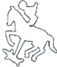
  - - <span style="color:green">Perfekte Infanterie/Recon + viel!</span>  
    - <span style="color:green">Starker Anti-Tank-Tab (Resita)</span>  
    - <span style="color:green">Starker Air-Tab (3 Karten Anti-Tank!)</span>  
    &nbsp;
    - <span style="color:red">Wenig Panzer und Artillerie</span>  
    - <span style="color:red">Mangel an 2k (AP und HE)</span>  
  - - **Calarasi**: Perfekte 10-Mann Recon (Sniper+Panzerfaust) (4 Karten)
    - **Rosiori**: Starkes Rifle Squad/CQC (Beretta+2xZB30+AT-Granate) (Hammer Availability-Kurve!)
    - **Pionieri Calari**: Starke Pioniere (2xBeretta+2xZB30+Granate) (Hammer Availability-Kurve!)
    - **Pionieri Asalt**: Sehr starke 10-Mann CQC (8xOrita+2xFlammenwerfer+Granate)
* - [715. Infanterie](https://steeldivision.fandom.com/wiki/715._Infanterie)
  - 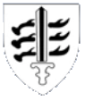
  - - <span style="color:green">Sehr gute Recon</span>  
    - <span style="color:green">Sehr gute Infanterie (viele Beretta)</span>  
    - <span style="color:green">Sehr gute Artillerie</span>  
    - <span style="color:green">Guter Panzermix</span>  
    &nbsp;
    - <span style="color:red">Etwas schwächere Anti-Air</span>  
    - <span style="color:red">Im Grunde nur Panzer IV</span>  
    - <span style="color:red">Schwache Flugzeuge</span>  
  - - S-Tier Potential!
    - <span style="color:DodgerBlue">**SDKFZ 135/1 150mm**: Sehr gute Artillerie! Bessere Hummel (2fache Mun, Reichweite!)</span>
    - **Mörser 531(f) 220mm**: Guter Mörser
    - <span style="color:DodgerBlue">**Decima (7xBeretta+MG42+Granate) + Decima Ardetti (6xBeretta+2xBreda+Panzerfaust)**: Sehr gute CQC </span>
    - **Lw-Jäger z.b.V.**: Sehr gutes Rifle Squad (10xSemiAuto+MG34+AT-Granate)
    - **Pz.Grenadier '41**: Bessere 12-Mann Panzergrenadiere (2xMG34+Panzerfaust)
```

&nbsp;

### *B-Tier*

```{list-table}
:header-rows: 1

* - Division
  - Wappen
  - Stärken / Schwächen
  - Anmerkungen
* - [5. SS-Panzer "Wiking"](https://steeldivision.fandom.com/wiki/5._SS-Panzer_%22Wiking%22)
  - 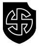
  - - <span style="color:green">Starke Panzer</span>  
    - <span style="color:green">Modernste Jäger</span>  
    - <span style="color:green">Gute mobile Artillerie</span>  
    &nbsp;
    - <span style="color:red">Wenig Anti-Air</span>  
    - <span style="color:red">Etwas zu wenig CQC</span>  
  - - <span style="color:DodgerBlue">**FW 190 F-8 AT Rocket**: Sehr guter AT-Flieger</span>
    - **FW 190 D-9**: Schnellster Axis-Jäger; Medium Resilience
    - **Panther A + D**: insg. 9 Karten
* - [Fallschirm-Panzer "Hermann Göring"](https://steeldivision.fandom.com/wiki/Fallschirm-Panzer_%22Hermann_G%C3%B6ring%22)
  - 
  - - <span style="color:green">Starke Einheiten in allen Tabs</span>  
    &nbsp;
    - <span style="color:red">Teure Einheiten</span>  
    - <span style="color:red">Zu wenig CQC</span>  
  - - **HG Begleit-Grenadiere**: Sehr gutes Rifle Squad (8xMP44+3xG43+MG42) (2 Karten)
    - **HG Pionier (MP-44)**: Sehr gute CQC (7xMP44+MG42+Granate) (1 Karte)
    - Einzige Division mit **Sturmtiger** (18 Damage!)     
* - [78. Sturm](https://steeldivision.fandom.com/wiki/78._Sturm)
  - 
  - - <span style="color:green">Sehr starke Infanterie</span>  
    - <span style="color:green">Starke Artillerie</span>  
    - <span style="color:green">Starke Anti-Air</span>  
    &nbsp;
    - <span style="color:red">Wenig Panzer (nur Stug III)</span>  
    - <span style="color:red">Teure Infanterie</span>   
  - - **Begleit-Grenadier**: Sehr gutes Rifle Squad (8xMP44+3xG43+MG42) (1 Karte)
    - <span style="color:DodgerBlue">**Begleit-Pionier**: Sehr gute 13-Mann CQC (9xMP44+3xG43+MG42+Granate)</span>
    - **Sturmschützen**: Sehr gute 13-Mann CQC (13xMP44+Panzerfaust) (3 Karten)
    - **S.IG 33**: Sehr gute Anti-Infantrie  
* - [1. Lovas](https://steeldivision.fandom.com/wiki/1._Lovas)
  - 
  - - <span style="color:green">Starke Infanterie</span>  
    - <span style="color:green">Turan Spam</span>  
    - <span style="color:green">Gute Flugzeuge</span>  
    &nbsp;
    - <span style="color:red">Wenig 2k</span>  
  - - <span style="color:DodgerBlue">**Huszar Golyoszorosok**: Eine der besten Rifle Squad; 16-Mann (12xFeg31M+3xSolothurn(MG)) (3 Karten)</span>
    - **41M Turán II**: Hoher HE-Damage, schießt schnell  
    - <span style="color:DodgerBlue">**36/40M Nimród**: Eine der beste AA im Spiel</span>  
    - <span style="color:DodgerBlue">**31M 149mm**: Eine der beste Artillerien im Spiel</span>
* - [122. Infanterie](https://steeldivision.fandom.com/wiki/122._Infanterie)
  - 
  - - <span style="color:green">Gute Finnische Infanterie</span>  
    - <span style="color:green">Guter 2k-Mix (HE und AT)</span>  
    &nbsp;
    - <span style="color:red">Viel mittelmäßige Infanterie</span>  
    - <span style="color:red">Mittelmässige Anti-Air</span>   
  - - <span style="color:DodgerBlue">**Tarkka-Ampuja**: Doppel-Sniper Recon!</span>  
    - **Soomepoisid**: Gutes Rifle-Squad (3xSuomi+5xSemiAuto+Lahti(MG) + Molotov)
    - **Lahti L-39**: Starkes Doppel-AT-Gun (!) Squad (Lahti: Beste AT-Gun im Spiel)
* - [11. SS-Fr.-Panzergrenadier "Nordland"](https://steeldivision.fandom.com/wiki/11._SS-Fr.-Panzergrenadier_%22Nordland%22)
  - 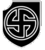
  - - <span style="color:green">Sehr gute Recon</span>  
    - <span style="color:green">Gute aber wenig Panzer</span>  
    - <span style="color:green">Gute Support und Anti-Tank</span>  
    &nbsp;
    - <span style="color:red">Wenig Tiefe, teure Slots, schwer Balanced zu spielen</span>  
    - <span style="color:red">Mittelmässige Artillerie</span>  
    - <span style="color:red">Keine AT-Flugzeuge</span>  
  - - **SPW 234/2 PUMA**: Sehr gutes Recon-Fzg (schnell und starkes Geschütz)
    - **FK 288(r)**: Günstiges Beutegeschütz (ZIS-3) (2 Karten)
    - <span style="color:DodgerBlue">**Ar 234 B-2 Heavy Bomber**: Phänomenaler, schneller Bomber (Jet-Engine!)</span>
* - [Verteidigungsbereich Toulon](https://steeldivision.fandom.com/wiki/Verteidigungsbereich_Toulon)
  - 
  - - <span style="color:green">Sehr starke Infantrie</span>  
    - <span style="color:green">Guter Anti-Tank und Artillerie-Tab</span>  
    - <span style="color:green">Bester Anti-Air-Tab im Spiel</span>  
    - <span style="color:green">LAFFY Transport: Bester Transporter</span>  
    &nbsp;
    - <span style="color:red">Keine gepanzerten Recon-Fahrzeuge</span>  
    - <span style="color:red">Schwacher Panzer-Tab</span>  
  - - <span style="color:DodgerBlue">**Maro**: 12-Mann Beretta Squad (sehr starke CQC)</span>  
    - **Brandenburger**: Sehr starke CQC + Doppel-MG42  
    - **KM Boot Besatzung**: Super Rifle-Squad (3xMG34)
    - <span style="color:DodgerBlue">**Flak 38 105mm**: Mächtigste Anti-Air im Spiel (OneShoot-Kill gegen Panzer)</span>
    - <span style="color:DodgerBlue">**Flakzwilling 37mm**: Tödlichste Anti-Air im Spiel</span>
* - [Panzergrenadier "Großdeutschland"](https://steeldivision.fandom.com/wiki/Panzergrenadier_%22Gro%C3%9Fdeutschland%22)
  - 
  - - <span style="color:green">Viele gute Panzer</span>  
    - <span style="color:green">Sehr guter Support (Grille,StuH + SDKFZ251/9D)</span>  
    &nbsp;
    - <span style="color:red">Wenig gute CQC</span>  
    - <span style="color:red">Zu wenig Medium Panzer (nur 2 Karten)</span>
    - <span style="color:red">Zu wenig Flugzeuge</span>
  - - **GD Sturmgruppe**: 8-Mann (8x MP44 + Panzerfaust)
    - **PaK 41 Gerlich 75mm**: Gute AT-Gun (durch 'Stealth: Very good' sehr schwer auszumachen)
* - [Kampfgruppe von Tettau](https://steeldivision.fandom.com/wiki/Kampfgruppe_von_Tettau)
  - 
  - - <span style="color:green">Sehr viel Infantrie</span>  
    - <span style="color:green">Sehr gute Anti-Air</span>  
    - <span style="color:green">Gute Flugzeuge</span>  
    &nbsp;
    - <span style="color:red">Mittelmässiger Panzer Tab</span>  
  - - 2 Karten **Königstiger**  
    - Artillerie im Grunde nur 'Rocket Artillery'  
    - **He-219/A0**: Sehr gut gegen Bodenziele und gegen Fighter + sehr schnell  
    - **SS-Junker (PzF)** - Sehr gutes Rifle Squad  
    - Taktik: Infanterie Spam  
* - [1. Páncélos](https://steeldivision.fandom.com/wiki/1._P%C3%A1nc%C3%A9los_Hadoszt%C3%A1ly)
  - 
  - - <span style="color:green">Gute günstige Infanterie</span>  
    - <span style="color:green">Sehr gute leichte Panzer</span>  
    - <span style="color:green">Sehr gute Anti-Air</span>  
    - <span style="color:green">Gute Artillerie</span>  
    &nbsp;
    - <span style="color:red">Schwache Infanterie in A</span>  
    - <span style="color:red">Schlechter Support-Tab</span>  
    - <span style="color:red">Probleme gegen schwere Panzer</span>  
    - <span style="color:red">Flugzeug-Tab locked in B</span>  
    - <span style="color:red">Zu wenig 2k</span>  
  - - **41M Turán II**: Hoher HE-Damage, schießt schnell  
    - <span style="color:DodgerBlue">**36/40M Nimród**: Eine der beste AA im Spiel</span>   
    - Taktik: Turan Spam  
* - [17. Divisioona](https://steeldivision.fandom.com/wiki/17._Divisioona)
  - 
  - - <span style="color:green">Viel 2K HE</span>  
    - <span style="color:green">Sehr gute leichte Panzer</span>  
    - <span style="color:green">Sehr gute Artillerie</span>  
    - <span style="color:green">Gute Anti-Air</span>  
    &nbsp;
    - <span style="color:red">Wenig Panzer</span>  
    - <span style="color:red">Probleme auf offenen Karten</span>  
  - - **Sext. Iskuryhma**: Sehr gute CQC (beste Submachine im Spiel (Suomi))  
* - [Panssaridivisioona](https://steeldivision.fandom.com/wiki/Panssaridivisioona)
  - 
  - - <span style="color:green">Gute finnische Infanterie</span>
    - <span style="color:green">Viele Panzer (nur Medium)</span>
    &nbsp;
    - <span style="color:red">Deck fehlt Tiefe, eher nicht Balanced zu spielen</span>  
    - <span style="color:red">Schwache Artillerie und wenig Anti-Tank</span>  
  - - **Jääkäri**: Sehr gutes Squad in mittlerer Distanz (0-500m) mit Molotov+Fanzerfaust  
    - <span style="color:DodgerBlue">**Syöksypioneeri**: Eine der besten Flamersquads im spiel (2xFlamer + 3xSuomi KP)</span>
    - <span style="color:DodgerBlue">**Tarkka-Ampuja**: Doppel-Sniper Recon!</span>
* - [1 Blindata "România Mare"](https://steeldivision.fandom.com/wiki/1_Blindata_%22Rom%C3%A2nia_Mare%22)
  - 
  - - <span style="color:green">Gute Infanterie</span>
    - <span style="color:green">Viele gepanzerte Fahrzeuge</span>
    &nbsp;
    - <span style="color:red">Mittelmässige Anti-Air und Artillerie</span>  
    - <span style="color:red">Im Grunde nur Bomber, nur eine Karte AT-Flugzeug</span>
  - - <span style="color:DodgerBlue">**Lt. Vanatori Moto**: Doppel-Sniper Leader!</span>
    - **Pionieri Asalt**: Eine der besten CQC im Spiel
    - **Vanatori De Care**: Sehr gute Anti-Tank-Infanterie (Panzerschreck+Granate)
* - [1. Skijäger](https://steeldivision.fandom.com/wiki/1._Skij%C3%A4ger)
  - 
  - - <span style="color:green">Guter Support- + AT-Tab</span>  
    - <span style="color:green">Solide Artillerie + Air</span>  
    &nbsp;
    - <span style="color:red">Wenig Infanterie, schnell aufgebraucht</span>  
    - <span style="color:red">Schwacher Panzer-Tab</span>  
  - - Aggressiv zu spielendes Deck, wenig Tiefe. Insgesamt wenig Karten.
    - **Sturm-Skijäger**: 9 MP44 + AT-Grenade
    - <span style="color:DodgerBlue">**Sturmpanzer KV-2(r)**: One-Shoot Killer! Beste Einheit im Deck</span>
    - **Panzerjäger RSO**: PAK-40 auf Ketten für 35 Pkt!  
    - **Bf 109 G-6/R4**: Doppel 30mm Jäger - sehr stark
* - [25. Hadosztály](https://steeldivision.fandom.com/wiki/25._Hadoszt%C3%A1ly)
  - 
  - - <span style="color:green">Günstige und viel Infanterie</span>  
    - <span style="color:green">Gute Artillerie</span> 
    &nbsp;
    - <span style="color:red">Zu wenig CQC</span>
    - <span style="color:red">Wenig Panzer und Support, kein 2K HE</span>
  - - **Lövész**: Gutes und günstiges 12-Mann Rifle Squad (1xMG+1xPanzerfaust) (7 Karten!)
    - **Fw 190 F-8**: Solider Fighter
```

&nbsp;

### *C-Tier*

```{list-table}
:header-rows: 1

* - Division
  - Wappen
  - Stärken / Schwächen
  - Anmerkungen
* - [3. Fallschirmjäger](https://steeldivision.fandom.com/wiki/3._Fallschirmj%C3%A4ger_(SD2))
  - 
  - - <span style="color:green">Starke Recon (u.a. Fs-Scharfschütze)</span>  
    - <span style="color:green">Starke Infanterie + Support</span>  
    - <span style="color:green">Sehr starkes Anti-Tank</span>  
    &nbsp;
    - <span style="color:red">Zu wenig CQC</span>  
    - <span style="color:red">Wenig Panzer (nur Stug III)</span>  
  - - <span style="color:DodgerBlue">**Fs-Jäger (FG-42)**: Perfektes Rifle Squad (2xFG42+2xMG42+Panzerfaust) (2 Karten)</span>  
    - <span style="color:DodgerBlue">**Fs-Jäger (ZF)**: Sniper Rifle Squad (2xMG42+Sniper) (4 Karten)</span>  
    - <span style="color:DodgerBlue">**Fs-Sturmjäger**: Höchste DPS-Einheit im Spiel (100-300m) (2xFG42+2xMG42+6xMP44)</span>
    - **LPAK 41 Gerlich 42mm**: Sehr gute PAK mit Stealth: Exceptional (sehr schwer zu orten)
    - **Püppchen**: Short-Range AT-Monster
    - **Hs 129 B-3**: Sehr gutes AT-Flugzeug (nicht zu schnell)
    - Taktik: Durchbrüche mit kleinen Infanteriegruppen (3-4 Gruppen + 1 Führer)
* - [12. SS-Panzer "Hitlerjugend"](https://steeldivision.fandom.com/wiki/12._SS-Panzer_(SD2))
  - 
  - - <span style="color:green">Starke Recon</span>  
    - <span style="color:green">Sehr starke Panzer</span>  
    - <span style="color:green">Starke Anti-Air</span>  
    - <span style="color:green">Gute mobile Artillerie</span>  
    - <span style="color:green">Modernsten Flugzeuge</span>  
    &nbsp;
    - <span style="color:red">Mittelmäßige Infantrie</span>  
    - <span style="color:red">Sehr teuer, zu wenig CQC</span>  
  - - <span style="color:DodgerBlue">**Fw 190 A-8**: Bester Jäger der Axis</span>
    &nbsp;
    - Taktik: Anti-Infantrie: **Grille**  
* - [1. Fallschirmjäger](https://steeldivision.fandom.com/wiki/1._Fallschirmj%C3%A4ger)
  - 
  - - <span style="color:green">Solider Support und Anti-Tank</span>  
    - <span style="color:green">Gute Flugzeuge</span>  
    &nbsp;
    - <span style="color:red">Generell wenig Optionen</span>  
    - <span style="color:red">Wenig Panzer - nur Tiger</span>  
    - <span style="color:red">Schwache Artillerie</span>  
  - - <span style="color:DodgerBlue">**Fs-Stosstrupp**: Perfekte CQC (2xBeretta+3xFG42+Molotov)</span>
    - <span style="color:DodgerBlue">**Fs-Jäger (FG-42)**: Perfektes Rifle Squad (2xFG42+2xMG42+Panzerfaust) (2 Karten)</span>
    - <span style="color:DodgerBlue">**Fs-Jäger (ZF)**: Sniper Rifle Squad (2xMG42+Sniper) (1 Karte)</span>  
* - [Sperrverband Kessel](https://steeldivision.fandom.com/wiki/Sperrverband_Kessel)
  - 
  - - <span style="color:green">Gute Infanterie (gute Mischung aus ungar. und dt. Einheiten)</span>  
    - <span style="color:green">Solide Panzer (Stug III + IV, Panzer IV)</span> 
    &nbsp;
    - <span style="color:red">Zu wenig Anti-Tank-Einheiten</span>  
    - <span style="color:red">Keine AT-Flugzeuge</span>  
    - <span style="color:red">Schlechte Artillerie</span>    
  - - **Hegyivadász**: Gute, günstige 13-Mann CQC (1xMG + 1xMolotov)
    - <span style="color:DodgerBlue">**Brandenburger**: 12-Mann Elite-CQC (6xG43+2xMG42+1xGranate)</span>
    - <span style="color:DodgerBlue">**Brandenb. MG 42**: Sehr gute MG-Einheit (+1 Mann, bessere Stealth und Optics als Standard MG42)</span>
* - [5. Gebirgsjäger](https://steeldivision.fandom.com/wiki/5._Gebirgsj%C3%A4ger)
  - 
  - - <span style="color:green">Infanterie (*Gebirgsjäger*) mit sehr guter Availability</span>  
    - <span style="color:green">Gute Recon (viele Sniper) und Flugzeuge</span>  
    &nbsp;
    - <span style="color:red">Zu wenig Panzer</span>  
    - <span style="color:red">Schlechte Anti-Air</span>  
    - <span style="color:red">Keine Long-range Waffen</span>  
  - <span style="color:DodgerBlue">**Geb. Führer**: Sehr guter Leader (3xBeretta, Sniper + Panzerschreck)</span>
* - [21. Panzer](https://steeldivision.fandom.com/wiki/21._Panzer_(SD2))
  - 
  - - <span style="color:green">Guter Support (Grille + Sturmpanzer IV)</span>  
    - <span style="color:green">Gute Artillerie, große Auswahl</span>  
    &nbsp;
    - <span style="color:red">Mittelmässige Infanterie</span>  
    - <span style="color:red">Im Grunde nur Panzer IV</span>
    - <span style="color:red">Mittelmässige Anti-Tank (keine PAK-40)</span>  
  - - <span style="color:DodgerBlue">**Sd.Kfz. 135/1 150mm**: Sehr gute Artillerie! Bessere Hummel (2fache Mun, Reichweite!)</span>  
    - **FW 190 A-8**: Sehr guter Jäger
    - **Königstiger**: 2 Karten im Deck
* - [116. Panzer](https://steeldivision.fandom.com/wiki/116._Panzer_(SD2))
  - 
  - - <span style="color:green">Sehr gute Recon und Support</span>  
    - <span style="color:green">Guter Panzer-Tab (gute Mischung) und AT-Tab</span>  
    &nbsp;
    - <span style="color:red">Zu hohe Slot-Kosten</span>  
    - <span style="color:red">Viel zu wenig Infanterie</span>  
    - <span style="color:red">*Balanced* nicht spielbar (zu wenig Tiefe)</span>  
  - - **Ersatz-Pionier**: Sehr gute Verfügbarkeit in A/B
    - **Panzer III L**: Guter, günstiger Panzer
    - **Ju88 A-4 (500kg)**: Guter Bomber
* - [25. Panzergrenadier](https://steeldivision.fandom.com/wiki/25._Panzergrenadier)
  - 
  - - <span style="color:green">Sehr gute Recon und AT</span>  
    - <span style="color:green">Sehr gute Artillerie</span>
    &nbsp;
    - <span style="color:red">Sehr schlechte Anti-Air</span>  
  - - **Stosstrupp (MP44)**: Gute günstige CQC  
    - **K35(t) 105mm**: Sehr gute Artillerie mit hoher Feuerrate  
    - <span style="color:DodgerBlue">**Nebelwerfer 42 300mm**: Beste Rocket Artillerie im Spiel</span>
* - [28. Jäger](https://steeldivision.fandom.com/wiki/28._J%C3%A4ger)
  - 
  - - <span style="color:green">Günstige und gute Infanterie</span>
    - <span style="color:green">Gute Support und Artillerie</span>
    - <span style="color:green">Sehr gute Flugzeuge</span>
    &nbsp;
    - <span style="color:red">Mittelmässige Anti-Tank</span>
  - - **Jäger**: Gute günstiges Rifle Squad (exz. Availability, 1xMG42+Panzerfaust)
    - **Jäger Pionier**: Gut im CQC und auf Entfernung (8xG43, MG42 + Granate)
    - <span style="color:DodgerBlue">**Sturmjäger**: Sehr gute Mid-Range Inf. (7xMP44, 2xG43, MG42 + AT-Granate)</span>
    - **HS 129 B-3**: Sehr gutes AT-Flugzeug
* - [Festung Dünkirchen](https://steeldivision.fandom.com/wiki/Festung_D%C3%BCnkirchen)
  - 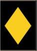
  - - <span style="color:green">Gute Infanterie, Support und Anti-Tank</span>
    - <span style="color:green">Sehr gute Anti-Air</span>
    &nbsp;
    - <span style="color:red">Wenig CQC</span> 
    - <span style="color:red">Wenig Panzer</span> 
    - <span style="color:red">Schwache Flugzeuge</span> 
  - - **Jagdkampf**: Sehr gute CQC (==Brandenburger) (6xG43+2xMG42+Panzerschreck)  
    - **Festungs-Grenadier**: 15-Mann Rifle Squad mit sehr guter Availability
    - **Erdkampflafette 43**: Phänomenales 1500m Autocannon-Geschütz (20mm)
    - <span style="color:DodgerBlue">**Jagdpanther**: Hammer! (230 Pen und 140 FA) (nur einmal verfügbar)</span>
    - <span style="color:DodgerBlue">**Flak 38 105mm**: Mächtigste Anti-Air im Spiel (OneShoot-Kill gegen Panzer)</span>
* - [5. Panzer](https://steeldivision.fandom.com/wiki/5._Panzer)
  - 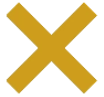
  - - <span style="color:green">Guter Tank-Tab (viele Panther und Tiger)</span>
    - <span style="color:green">Gute Anti-Air</span>
    &nbsp;
    - <span style="color:red">Mittelmässige Infanterie, schlechte CQC</span>  
    - <span style="color:red">Mittelmässige Artillerie</span>  
  - - **S.Panzerbüchse 41**: Gutes kleines Geschütz (1000m, 100mm Pen, 15 r/m) (Kosten: 25!)
    - 11 Karten Panther und 4 Karten Tiger
* - [Panzer-Lehr](https://steeldivision.fandom.com/wiki/Panzer-Lehr_(SD2))
  - 
  - - <span style="color:green">Fantastischer Recon Tab</span>  
    - <span style="color:green">Guter Panzer- und AT-Tab</span>  
    - <span style="color:green">Gute Artillerie</span>  
    &nbsp;
    - <span style="color:red">Zu hohe Slot-Kosten und zu wenige Slots</span>  
    - <span style="color:red">Mittelmäßige Infanterie</span>
    - <span style="color:red">Zu teuer und langsam</span>  
  - - **SPW 234/2 PUMA**: Sehr gutes gepanzertes Fahrzeug  
    - **Pz.Grenadier (PzSchk)**: Phänomenale Panzergrenadiere  
    - **Borgward IV**: Kann Teil von Ortschaft zerstören  
    - <span style="color:DodgerBlue">**FW 190 A-8**: Einer der besten Fighter im Spiel</span>
* - [20. Panzergrenadier](https://steeldivision.fandom.com/wiki/20._Panzergrenadier)
  - 
  - - <span style="color:green">Guter Support und Anti-Tank</span>  
    - <span style="color:green">Vielfältige Anti-Air, aber teuer</span>  
    &nbsp;
    - <span style="color:red">Schwache Recon</span>  
    - <span style="color:red">Mittelmässige Infanterie, wenig CQC</span>
  - - **Elefant**:  3 Karten (nur 180 Punkte)
    - **Stug IV**: 5 Karten (max. 30 möglich)
* - [16. Panzer](https://steeldivision.fandom.com/wiki/16._Panzer)
  - 
  - - <span style="color:green">Gute Recon, viele SPW</span>  
    - <span style="color:green">Guter Tank-Tab und Artillerie</span>  
    - <span style="color:green">Gute Flugzeuge (viel FW F-8)</span>  
    &nbsp;
    - <span style="color:red">Wenig Infanterie</span>  
    - <span style="color:red">Mittelmässige Anti-Air</span>  
  - - **Königstiger**:  3 Karten (max. 7 möglich)
    - **FW 190 F-8 AT Rocket**: Sehr gutes AT-Flugzeug
* - [14. Infanterie](https://steeldivision.fandom.com/wiki/14._Infanterie)
  - 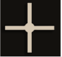
  - - <span style="color:green">Gute Panzer (Stug III + Tiger E) und Support</span>  
    - <span style="color:green">Gute Infanterie</span>  
    &nbsp;
    - <span style="color:red">Mittelmässige Recon</span>  
    - <span style="color:red">Schlechte Anti-Air</span>  
  - - **Begleit-Grenadier**: Gutes Rifle-Squad (8xMP44+3xG43+MG42)
    - <span style="color:DodgerBlue">**Begleit-Pionier**: Super CQC (9xMP44+3xG43+MG42+Granate)</span>
* - [12. Tartalék](https://steeldivision.fandom.com/wiki/12._Tartal%C3%A9k)
  - 
  - - <span style="color:green">Viel Infanterie</span>  
    - <span style="color:green">Gute Anti-Air</span>  
    &nbsp;
    - <span style="color:red">Wenig Panzer</span> 
    - <span style="color:red">Mittelmässiger Support</span> 
  - - **Golyószórósok**: 12-Mann Rifle Squad mit 3xMG30
    - <span style="color:DodgerBlue">**31M 149mm**: Eine der beste Artillerien im Spiel</span>
    - **Me 210 CA-1 Proto**: Gutes AT-Flugzeug (40mm!)
* - [4a Alpina "Monterosa"](https://steeldivision.fandom.com/wiki/4a_Alpina_%22Monterosa%22)
  - 
  - - <span style="color:green">Gute CQC</span>  
    - <span style="color:green">Sehr gute Flugzeuge</span>  
    &nbsp;
    - <span style="color:red">Schwache (nur leichte) Panzer </span>  
    - <span style="color:red">Wenig Anti-Tank und Support</span>  
    - <span style="color:red">Mittelmässige Anti-Air und Artillerie</span>  
  - - <span style="color:DodgerBlue">**Pionieri**: Eine der beste CQC (4xBeretta+Flammenwerfer+Granate)</span>
    - **Ju87 G-1**: Guter AT-Flieger
* - [4 Munte](https://steeldivision.fandom.com/wiki/4_Munte)
  - 
  - - <span style="color:green">Phänomenale Recon (Sniper ohne Ende)</span>  
    - <span style="color:green">Gute Infanterie (sehr gute Availability)</span>  
    - <span style="color:green">Gute Flugzeuge</span>  
    &nbsp;
    - <span style="color:red">Keine Armor in A</span>  
    - <span style="color:red">Mittelmässige Artillerie</span>  
    - <span style="color:red">Mittelmässige Panzer (nur Panzer IV)</span>   
  - - **Lt. VM**: Sehr guter Leader (Sniper+Panzerschreck)
    - <span style="color:DodgerBlue">**Vanatori Cercetare**: Beste Sniper im Spiel (Recon)</span>
    - **Vanatori de Care**: Bestes Anti-Tank-Team im Spiel (Availability!)
* - [352. Infanterie](https://steeldivision.fandom.com/wiki/352._Infanterie_(SD2))
  - 
  - - <span style="color:green">Phänomenaler Anti-Tank-Tab</span>  
    - <span style="color:green">Gute Flugzeuge</span>  
    &nbsp;
    - <span style="color:red">Schwache Infanterie, wenig CQC</span>  
    - <span style="color:red">Schwacher Panzer-Tab</span>  
  - - <span style="color:DodgerBlue">**Jagdpanther**: Sehr guter schwerer Panzer</span>
    - **HS 129 B-3 Tank Buster**: Sehr gutes AT-Flugzeug
* - [Ryhmä Raappana](https://steeldivision.fandom.com/wiki/Ryhm%C3%A4_Raappana)
  - 
  - - <span style="color:green">Gute Recon (viele Sniper)</span>  
    - <span style="color:green">Gute günstige Infanterie</span>  
    - <span style="color:green">Gute Flugzeuge</span>  
    &nbsp;
    - <span style="color:red">Keine Panzer</span>  
    - <span style="color:red">Schwacher Support und 2K-HE</span>  
  - - <span style="color:DodgerBlue">**Tarkka-Ampuja**: Doppel-Sniper Recon!</span>  
    - **Jääkäri**: Gutes, günstiges Rifle Squad (3xSuomi+Molotov+Panzerfaust)
    - <span style="color:DodgerBlue">**Syöksypioneeri**: Sehr gute CQC (3xSuomi+2xFlammenwerfer)</span>
```

&nbsp;

### *D-Tier*

```{list-table}
:header-rows: 1

* - Division
  - Wappen
  - Stärken / Schwächen
  - Anmerkungen
* - [Unternehmen Rösselsprung](https://steeldivision.fandom.com/wiki/Unternehmen_R%C3%B6sselsprung)
  - 
  - - <span style="color:green">Sehr gute Recon, viele SPW</span>  
    - <span style="color:green">Sehr gute Infanterie</span>  
    &nbsp;
    - <span style="color:red">Wenig und nur schlechte Panzer</span>  
    - <span style="color:red">Schlechte Anti-Air</span>  
    - <span style="color:red">Mittelmäßige Artillerie</span>  
  - - <span style="color:DodgerBlue">**Brandenburger**: Elite 12-Mann Rifle Squad (6xG43+2xMG42+Granate)</span>
    - **Brandenburger Pioniere**: Gute CQC (6xMP40+2xFlammenwerfer)
* - [Korück 559](https://steeldivision.fandom.com/wiki/Kor%C3%BCck_559)
  - 
  - - <span style="color:green">Passable Recon und Air</span>  
    &nbsp;
    - <span style="color:red">Übertrieben teure Tabs</span>  
    - <span style="color:red">So gut wie keine CQC</span>  
    - <span style="color:red">Schräge Panzer</span>  
    - <span style="color:red">Schlechte Anti-Air und Artillerie</span>  
  - - **PAK 36 37mm**: Sehr schnelle Feuerrate (15-20 Schuss/min)  
    - **Ju 87 G-1**: Sehr guter Panzerjäger
* - [52. Sicherungs-Division z.b.V.](https://steeldivision.fandom.com/wiki/52._Sicherungs-Division_z.b.V.)
  - 
  - - <span style="color:green">Gute Infanterie</span>  
    - <span style="color:green">Gute Anti-Tank und Air</span>  
    &nbsp;
    - <span style="color:red">Schwer zu spielen (Phase locking)</span>  
    - <span style="color:red">Wenig Panzer bis C</span>  
    - <span style="color:red">Mittelmässiger Support und Artillerie</span>  
  - - <span style="color:DodgerBlue">**Jagdpanther**: Sehr guter schwerer Panzer</span>  
    - <span style="color:DodgerBlue">**Fs-Jäger (FG-42)**: Perfektes Rifle Squad (2xFG42+2xMG42+Panzerfaust) (1 Karte)</span>
* - [Panzerverband Strachwitz](https://steeldivision.fandom.com/wiki/Panzerverband_Strachwitz)
  - 
  - - <span style="color:green">Gute Panzermischung</span>  
    - <span style="color:green">Gute Luftwaffe</span>  
    &nbsp;
    - <span style="color:red">Viel zu wenig und mittelmässige Infanterie</span> 
    - <span style="color:red">Schwacher Anti-Tank-Tab</span> 
  - - **Sd.Kfz. 251/9D**: Gute Support-Einheit (Pen. 100mm)
    - **Panther** (7 Karten) und **Tiger** (1 Karte)
    - **FW 190 A8**: Guter Jäger, Medium Resilience
```

&nbsp;

## ALLIES

### *S-Tier*

```{list-table}
:header-rows: 1

* - Division
  - Wappen
  - Stärken / Schwächen
  - Anmerkungen
* - [C.I.A.B.G.](https://steeldivision.fandom.com/wiki/C.I.A.B.G.)
  - 
  - - <span style="color:green">Günstige Infanterie</span>  
    - <span style="color:green">Starke Panzer</span>  
    - <span style="color:green">Sehr gute Artillerie</span>  
    - <span style="color:green">Gute Flugzeuge</span>  
    - <span style="color:green">Günstige Infanterie</span>  
    &nbsp;
    - <span style="color:red">Wenig CQC</span>  
  - - <span style="color:DodgerBlue">**Typhoon Mk Ib**: Beste AT Rocket Flugzeug im Spiel</span> 
    - **17-PDR 76.2mm**: sehr gutes AT Geschütz (2 Karten)  
    - **Zeniste**: Sehr gute CQC (4 Thompson + Flamer)  
* - [2nd Infantry](https://steeldivision.fandom.com/wiki/2nd_Infantry)
  - 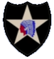
  - - <span style="color:green">Sehr gute Artillerie und Flugzeuge</span>  
    - <span style="color:green">Gute 2k</span>  
    &nbsp;
    - <span style="color:red">Mittelmässige CQC</span>  
    - <span style="color:red">Schwacher Panzer-Tab (nur *M4A1*)</span>  
  - - **M4A1**: Schlechteste Version des Sherman - sehr stark gegen 'weiche' Ziele
    - **M3 HOW 105mm**: Sehr starkes 2K HE Geschütz
    - **P-47D-23-RA**: Sehr starkes Rocket Anti-Tank Flugzeug
* - [1st Special Brigade](https://steeldivision.fandom.com/wiki/1st_Special_Service_Brigade)
  - 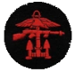
  - - <span style="color:green">Sehr gute Infanterie</span>  
    - <span style="color:green">Sehr gute Anti-Air</span>  
    - <span style="color:green">Extrem starke Off-Map</span>  
    - <span style="color:green">Sehr schnelle Division</span>  
    &nbsp;
    - <span style="color:red">Extrem Phase-Locked Anti-Tank</span>  
    - <span style="color:red">Mittelmässige Artillerie</span>  
  - - Sehr viele **Hellcat I** Cards bei Flugzeugen  
    - Sehr viele **Shermans**  
    - <span style="color:DodgerBlue">**Commando No4**: Mit die beste CQC im Spiel</span>  
    - **Commando No6**: Sehr gutes Rifle Squad mit Sniper  
* - [1st Airborne TaskForce](https://steeldivision.fandom.com/wiki/1st_Airborne_Task_Force)
  - 
  - - <span style="color:green">Viel sehr gute Infanterie + Recon</span>  
    - <span style="color:green">Sehr gute Luftwaffe</span>  
    - <span style="color:green">Sehr gute Anti-Tank</span>  
    &nbsp;
    - <span style="color:red">Deck hat keine Tiefe, d.h. wird wohl nicht 'Balanced' gespielt werden</span>  
    - <span style="color:red">Schlechte Anti-Air, keine AA in Phase A</span>  
    - <span style="color:red">Mittelmäßige Artillerie</span>  
  - - **Forceman**: sehr starke CQC/Mid-Range Infanterie  
    - **Beaufighter Mk X**: starkes AT Flugzeug  
    - Taktik: Häuserkampf/Nahkampf suchen  
    - Taktik: Kampf im offenen Gelände vermeiden  
```

&nbsp;

### *A-Tier*

```{list-table}
:header-rows: 1

* - Division
  - Wappen
  - Stärken / Schwächen
  - Anmerkungen
* - [101st Airborne](https://steeldivision.fandom.com/wiki/)
  - 
  - - <span style="color:green">...</span>  
    &nbsp;
    - <span style="color:red">tbd</span>  
  - - <span style="color:DodgerBlue">tbd</span>
    - tbd
* - [Guards Armoured](https://steeldivision.fandom.com/wiki/)
  - 
  - - <span style="color:green">...</span>  
    - <span style="color:green">...</span>  
    &nbsp;
    - <span style="color:red">...</span>  
    - <span style="color:red">...</span> 
  - - <span style="color:DodgerBlue">tbd</span>
    - tbd
* - [4th Armored](https://steeldivision.fandom.com/wiki/)
  - 
  - - <span style="color:green">...</span>  
    &nbsp;
    - <span style="color:red">...</span>  
  - - <span style="color:DodgerBlue">tbd</span>
    - tbd
* - [7th Armored "Desert Rats"](https://steeldivision.fandom.com/wiki/)
  - 
  - - <span style="color:green">...</span>  
    &nbsp;
    - <span style="color:red">...</span>  
  - - <span style="color:DodgerBlue">tbd</span>
    - tbd
* - [Demi-Brigade SAS](https://steeldivision.fandom.com/wiki/)
  - 
  - - <span style="color:green">...</span>  
    &nbsp;
    - <span style="color:red">...</span>  
  - - <span style="color:DodgerBlue">tbd</span>
    - tbd
* - [1st Infantry](https://steeldivision.fandom.com/wiki/)
  - 
  - - <span style="color:green">...</span>  
    &nbsp;
    - <span style="color:red">...</span>  
  - - <span style="color:DodgerBlue">tbd</span>
    - tbd
* - [4th Canadian Armoured](https://steeldivision.fandom.com/wiki/)
  - 
  - - <span style="color:green">...</span>  
    &nbsp;
    - <span style="color:red">...</span>  
  - - <span style="color:DodgerBlue">tbd</span>
    - tbd
* - [84-ya Gvard. Strelkovy](https://steeldivision.fandom.com/wiki/84-ya_Gvard._Strelkovy)  
  - 
  - - <span style="color:green">Sehr starke Armor</span>  
    - <span style="color:green">Stark in allen Tabs</span>  
  - - Beste sowjetische Division  
    - <span style="color:DodgerBlue">**ISU-152**: Beste sowjetische Einheit im Spiel</span>  
* - [97-ya Gvard. Strelkovy](https://steeldivision.fandom.com/wiki/97-ya_Gvard._Strelkovy)  
  - 
  - - <span style="color:green">Starke Panzer</span>  
    - <span style="color:green">Sehr viel und sehr gute Off-Map Artillerie</span>  
    - <span style="color:green">Gute Infanterie</span>  
  - - <span style="color:DodgerBlue"></span>**GPA KAO (132 mm)**: Stärkste Off-Map-Artillerie im Spiel</span>  
    - **IS-2 obr.1944**: 2 Karten; maximal 6 Stück möglich  
    - Viele **T-34/76 1942** (1 Karte; 16 in B oder 22 in C) und **T-34/85 Komroti** (1 Karte; max. 3 in C)  
    - Taktik: Mit Panzern den Gegner in den Ebenen dominieren und dann mit der überaus effizienten (da günstigen) Infanterie stürmen  
    - Taktik: Mit Off-Map Gebiete ‚vorbereiten‘ und dann mit Truppen nachstoßen  
* - [26-ya Gvard. Strelkovy](https://steeldivision.fandom.com/wiki/26-ya_Gvard._Strelkovy)  
  - 
  - - <span style="color:green">Starke Infanterie</span>  
    - <span style="color:green">2 Karten ISU-152</span>  
    &nbsp;
    - <span style="color:red">Sehr schlechte Anti-Air</span>  
    - <span style="color:red">Schwächerer Anti-Tank Tab</span>  
    - <span style="color:red">Probleme gegen schwere Panzer</span>  
    - <span style="color:red">Keine schwere Artillerie</span>  
  - - **Shturmoviki (Roks)**: sehr gute CQC (6xPPSh+2xFlammenwerfer) (2 Karten)
    - **Shtrafniki**: beste Rifle Squad; 20-Mann (3xPPSh+3xDP28(MG)+PTRD) (1 Karte)
* - [1e DFL](https://steeldivision.fandom.com/wiki/1e_DFL)  
  - 
  - - <span style="color:green">Starke Infanterie</span>  
    - <span style="color:green">Gute Artillerie</span>  
    - <span style="color:green">Sehr gute Flugzeuge</span>  
    &nbsp;
    - <span style="color:red">Wenig Tiefe, schwer auf Balanced</span>  
    - <span style="color:red">Schwache Panzer und AT</span>   
  - - **Bimp Tranape**: Sehr gutes Rifle Squad (2xThompson+2xBren+Bazooka)
    - **Legionnaires**: Sehr starke CQC (13-Mann, fanatisch)
    - <span style="color:DodgerBlue">**Legion. Sap.-Pionniers**: Super CQC (3xThompson+2xFlammenwerfer)</span>
    - **P47D-22-RE**: Sehr guter, sehr schneller Bomber
* - [Div. 8 Cav. Purtată](https://steeldivision.fandom.com/wiki/Div._8_Cav._Purtat%C4%83)  
  - 
  - - <span style="color:green">Starke Anti-Tank (Resita!)</span>  
    - <span style="color:green">Starke Infanterie</span>  
    - <span style="color:green">Gute Anti-Air</span>  
    &nbsp;
    - <span style="color:red">Mangel an CQC-Einheiten</span>  
    - <span style="color:red">Mangel an Panzern</span>   
  - - **Calarasi**: 10-Mann Recon mit Scharfschütze + Panzerfaust! (4 Karten!)
    - **Roșiori Asalt**: Sehr gute CQC (12-Mann, 4xBeretta+Molotov)
* - [Task Force 45](https://steeldivision.fandom.com/wiki/Task_Force_45)  
  - 
  - - <span style="color:green">Sehr gute Infanterie und Recon</span>  
    - <span style="color:green">Sehr starke Anti-Air</span>   
    - <span style="color:green">Gute Flugzeuge</span>   
    &nbsp;
    - <span style="color:red">Nicht viele Antworten gegen schwere Armor</span>  
    - <span style="color:red">Nur Shermans verfügbar</span>  
    - <span style="color:red">Mittelmässige Support und Anti-Tank</span>  
  - - **Cavalry Scouts**: Gute Recon (6-Mann mit Bazooka)
    - **Conv. Gunners**: Gutes 15-Mann Rifle Squad mit sehr guter Availability (12/24/36) (3 Karten)
    - <span style="color:DodgerBlue">**Nisei Rifles**: Eine der besten Rifle Squads im Spiel (Thompson+2xM19+Bazooka, fanatisch)</span>
    - **M1 8-inch 203mm**: Sehr starke Artillerie (Ammo immer extra)
    - **P47D-22-RE**: Sehr guter, sehr schneller Bomber
* - [Rezerv 43-y Armii](https://steeldivision.fandom.com/wiki/Rezerv_43-y_Armii)  
  - 
  - - <span style="color:green">Gute Infanterie</span>  
    - <span style="color:green">Guter Panzer-Tab und AT-Tab</span>  
    &nbsp;
    - <span style="color:red">Sehr schwache Artillerie</span>  
    - <span style="color:red">Schwache Anti-Air und Recon</span>   
  - - **Saperi (Roks)**: Sehr gute CQC  
    - **Shtrafniki (Officeri)**: Sehr gutes Rifle Squad  
    - **Yak 9b**: Guter Bomber (schnelles Rearmament)  
    - 2 Karten **IS-2 obr.1943** (maximal 8 Stück möglich) und 2 Karten **SU-152** (max. 14 Stück möglich)  
* - [Corpul VI Teritorial](https://steeldivision.fandom.com/wiki/Corpul_VI_Teritorial)  
  - 
  - - <span style="color:green">Sehr gute Infanterie</span>  
    - <span style="color:green">Gute Artillerie und Flugzeuge</span>  
    &nbsp;
    - <span style="color:red">Sehr schwache A-Phase (keine Armor)</span>  
    - <span style="color:red">Schwacher Support und Anti-Air</span>  
  - - **Calarasi**: 10-Mann Recon mit Scharfschütze + Panzerfaust! (4 Karten!)
    - **Avtomatchiki**: Gute 10-Mann CQC (10xPPSH+Granate)
    - **Il-2M AT Rocket 132mm**: Sehr gutes AT-Flugzeug
* - [Podv. Gruppa Fedyunkina](https://steeldivision.fandom.com/wiki/Podv._Gruppa_Fedyunkina)  
  - 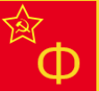
  - - <span style="color:green">Sehr günstige, gute Infanterie</span>  
    - <span style="color:green">Sehr gute Support und Anti-Tank</span>  
    - <span style="color:green">Sehr gute Flugzeuge</span>  
    &nbsp;
    - <span style="color:red">Mittelmässige Artillerie</span>
  - - **Saperi (PPSh)**: Sehr günstige CQC (Kosten: 10) 4-Mann (4xPPSH+Panzerfaust)
    - **Avtomatchiki**: Gute 10-Mann CQC (10xPPSH+Granate)
    - **Strelki (DT)**: Sehr gutes Rifle Squad (3xPPSH+2xDT(MG)+Molotov)
    - <span style="color:DodgerBlue">**ISU-152**: Beste sowjetische Einheit im Spiel - sehr guter Tank Destroyer (2 Karten)</span>
    - <span style="color:DodgerBlue">**BS-3 100mm**: Riesen Anti-Tank Geschütz (100mm!)</span>
* - [6th Airborne](https://steeldivision.fandom.com/wiki/6th_Airborne_(SD2))  
  - 
  - - <span style="color:green">Sehr starke Sniper-Einheiten und Flugzeuge</span>  
    - <span style="color:green">Gute Infanterie und Anti-Tank</span>  
    &nbsp;
    - <span style="color:red">Schwacher Tank- und Support-Tab</span>  
    - <span style="color:red">Schwache Anti-Air</span>   
  - - **AB Paras**: Solide 10-Mann Sniper-Einheit (4 Karten)  
    - **RM Centaur IV**: Sehr gute HE-Artillerie auf Ketten  
    - **Tempest Mk. V**: Schnellster Bomber im Spiel (645km/h!), sehr gut!  
    - <span style="color:DodgerBlue">**Typhoon Mk. IB**: Bestes AT-Flugzeug im Spiel (8 Raketen!)</span>
```

&nbsp;

### *B-Tier*

```{list-table}
:header-rows: 1

* - Division
  - Wappen
  - Stärken / Schwächen
  - Anmerkungen
* - [44-ya Gvard. Strelkovy](https://steeldivision.fandom.com/wiki/44-ya_Gvard._Strelkovy)  
  - 
  - - <span style="color:green">Starke Panzer</span>  
    - <span style="color:green">Sehr viel günstige Infanterie</span>  
    - <span style="color:green">Viel T-34/76 1943 und T-34/85 1944</span>  
    &nbsp;
    - <span style="color:red">Mittelmässige Anti-Tank</span>  
    - <span style="color:red">Schwächere Artillerie</span>  
  - - **Tankodesantniki**: Gute CQC (8xPPSh+Molotov)
    - **Saperi**: Gute CQC (bessere Rifles als dt. Pioniere)
    - **SU-152**: 2000m HE (Äquivalent zur 'Grille')
    - **Il-2M**: Solides AT-Flugzeug
* - [2nd New Zealand](https://steeldivision.fandom.com/wiki/2nd_New-Zealand)  
  - 
  - - <span style="color:green">Gute Sniper-Recon</span>  
    - <span style="color:green">Starke Flugzeuge</span>  
    &nbsp;
    - <span style="color:red">Mittelmässige Panzer (nur Sherman III)</span>
    - <span style="color:red">Schwache Artillerie</span>
  - - **Maori**: Gutes Rifle Squad und CQC (2xThompson+2MG34, fanatisch)
    - **Spitfire Mk. Vc/trop Mitralexis**: Guter Fighter 
* - [10-y Gv. Tank. Korpus](https://steeldivision.fandom.com/wiki/10-y_Gv._Tank._Korpus)  
  - 
  - - <span style="color:green">Viele Beutepanzer (Tiger+Panther)</span>  
    - <span style="color:green">Viel T-34/76 und T-34/85</span>  
    - <span style="color:green">Viel Artillerie + gute Flugzeuge</span>  
    &nbsp;
    - <span style="color:red">Mangel an guter Infanterie</span>  
    - <span style="color:red">Sehr schwache Anti-Air</span>  
  - - Bis zu 9 **T-6 Tigr** möglich  
    - 2 **T-5 Panther** in A möglich  
    - <span style="color:DodgerBlue">**OB-25 76.2mm**: Bestes HE-Geschütz</span>  
* - [1 Piechoty "Tadeusza Kościuszki"](https://steeldivision.fandom.com/wiki/1_Piechoty_%22Tadeusza_Ko%C5%9Bciuszki%22)  
  - 
  - - <span style="color:green">Sehr viel günstige Infanterie</span>  
    - <span style="color:green">Viel T-34/76 und T-34E (Pol) (vor allem ab C)</span>  
    - <span style="color:green">Gute Flugzeuge</span>  
    &nbsp;
    - <span style="color:red">Probleme gegen schwere Panzer</span>  
    - <span style="color:red">Schwächere Support und Artillerie</span>  
  - - Taktik: T34 Spam / Infanterie Spam
    - **Oddzial Karny**: Gutes 20-Mann Rifle-Squad (3xPPSh+3xDP-28(MG)+PTRD)
    - **Desant Czolgowy**: Gute CQC (8xPPSh+Molotov)
    - **Saperzy (Roks)**: Sehr gute CQC (4xPPSH+2xDP28(MG)+Flammenwerfer)
    - **Il-2M**: Sehr gute Bomber/AT-Flugzeuge (versch. Typen)
* - [Corpo Italiano di Liberazione](https://steeldivision.fandom.com/wiki/Corpo_Italiano_di_Liberazione)  
  - 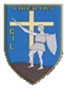
  - - <span style="color:green">Sehr gute und viel Infanterie</span>  
    - <span style="color:green">Sehr gute Flugzeuge</span>  
    &nbsp;
    - <span style="color:red">Mittelmässige Panzer (Sherman III)</span>  
    - <span style="color:red">Sehr schwache Anti-Air und Artillerie</span>  
  - - <span style="color:DodgerBlue">**Maro**: Sehr gute CQC (9xBeretta+Panzerfaust)</span>
    - **Arditi**: Gute CQC (3xBeretta+2xBren+TNT)
    - **Maro (Bren)**: Sehr gutes Rifle Squad (4xBren+Panzerfaust)
    - **Beaufighter Mk X**: Sehr gutes AT-Flugzeug (8 Raketen!)
    - Taktik: Infanterie Spam  
* - [Podv. Gruppa Vyborg](https://steeldivision.fandom.com/wiki/Podv._Gruppa_Vyborg)  
  - 
  - - <span style="color:green">2 Karten IS-2 (bzw. IS-2 Komroti)</span>  
    - <span style="color:green">Gute Anti-Tank</span>  
    &nbsp;
    - <span style="color:red">Wenig brauchbare Panzer, hauptsächlich leichte und mittlere</span>  
    - <span style="color:red">Mittelmäßiger Support</span>  
  - - **Avtomatchiki**: Gute 10-Mann CQC (10xPPSH+Granate)  
    - **Shturmoviki**: Sehr Gute CQC (7xPPSH+DT(MG)+TNT)
    - **BM-31-12 Andryusha**: Gute Rocket Artillerie
* - [2e Blindee](https://steeldivision.fandom.com/wiki/2e_Blindee_(SD2))  
  - 
  - - <span style="color:green">Guter Recon und Support</span>  
    &nbsp;
    - <span style="color:red">Keine schweren Panzer</span>  
    - <span style="color:red">Probleme gegen schwere Panzer</span>  
  - - **Sapeurs**: Gute CQC (2xThompson+Bazooka+TNT)
    - **Char M4A3(76)**: Guter Panzer (185mm Pen + 100mm FA)
    - Taktik: Light/Medium Tank Spam  
* - [Groupement Dody](https://steeldivision.fandom.com/wiki/Groupement_Dody)  
  - 
  - - <span style="color:green">Sehr gute Infanterie</span>  
    - <span style="color:green">Gute Artillerie</span>  
    - <span style="color:green">Sehr gute Flugzeuge</span>  
    &nbsp;
    - <span style="color:red">Schwächere Anti-Tank</span>  
    - <span style="color:red">Mittelmäßige Panzer</span>  
  - - **Goumiers Eclaireurs**: Gute 10-Mann Sniper Recon
    - <span style="color:DodgerBlue">**Goumiers (PM)**: Sehr gute 22-Mann CQC (Bazooka+5xThompson)</span>  
    - **AB Rifles**: Sehr gutes 12-Mann Rifle Squad (Bazooka+1xMG+2xThompson)  
    - **P-47D-22-RE**: Schneller, schwerer Bomber, MedRes  
* - [1. Pancerna](https://steeldivision.fandom.com/wiki/1._Pancerna_(SD2))  
  - 
  - - <span style="color:green">Sehr gute Anti-Air</span>  
    - <span style="color:green">Sehr gute Anti-Tank</span>  
    - <span style="color:green">Viele mittlere Panzer + Tank Destroyer</span>  
    &nbsp;
    - <span style="color:red">Mittelmässige Infanterie</span>  
    - <span style="color:red">Mittelmässige Artillerie</span>  
  - - **Armata 17-pdr**: Sehr gutes AT Geschütz (4 Karten)  
    - **Firefly Vc (Pol)**: 170mm Pen; 3+1 Karten  
    - **Achilles IIc**: 170mm Pen; 4 Karten  
    - **Hurricane Mk IV**: Guter Panzerjäger  
    - Viele **Cromwell V** (5 Karten) und **Stuart V** (4 Karten)  
* - [3rd Armored "Spearhead"](https://steeldivision.fandom.com/wiki/3rd_Armored_(SD2))  
  - 
  - - <span style="color:green">Viele Panzer (Sherman+Stuart)</span>  
    - <span style="color:green">Gute Artillerie und Anti-Tank</span>  
    &nbsp;
    - <span style="color:red">Wenig Tiefe, ungeeignet für Balanced</span>  
    - <span style="color:red">Wenig und mittelmässige Infanterie</span>  
    - <span style="color:red">Schwache Anti-Air</span>  
  - - **M4A1(76)**: Solider Panzer mit 130 Pen
    - **M4A3E3 Jumbo**: 190mm FA aber nur 90mm Pen
* - [8th Indian Infantry](https://steeldivision.fandom.com/wiki/8th_Indian_Infantry)  
  - 
  - - <span style="color:green">Gute Anti-Air und Artillerie</span>  
    - <span style="color:green">Gute Flugzeuge</span>  
    &nbsp;
    - <span style="color:red">Mittelmässige Panzer (nur Sherman V)</span>  
    - <span style="color:red">Schwacher Support</span>  
  - - <span style="color:DodgerBlue">**Gurkhas Rifles**: Super 12-Mann Rifle Squad (3xThompson+2xBren+Granate) (2 Karten)</span>
    - **BL 4.5-Inch 114mm**: Sehr gute, günstige Artillerie 
    - **Hurricane Mk IV**: Gutes AT-Flugzeug
* - [7-y Mechanizi. Korpus](https://steeldivision.fandom.com/wiki/7-y_Mechanizi._Korpus)  
  - 
  - - <span style="color:green">Sehr gute 2K-HE (SU-122 und SU-152)</span>  
    - <span style="color:green">Solide Flugzeuge</span>  
    &nbsp;
    - <span style="color:red">Mittelmässige Panzer (nur (aber viele) T34/76)</span>  
    - <span style="color:red">Mittelmässige Artillerie</span>  
  - - **Tankodesantniki**: Gute CQC (8xPPSh+Molotov)
    - **Avtomatchiki**: Gute 10-Mann CQC (10xPPSH+Granate)
    - <span style="color:DodgerBlue">**ISU-152**: Beste sowjetische Einheit im Spiel - sehr guter Tank Destroyer</span>
    - **Pe-2-83**: Gute Bomber
```

&nbsp;

### *C-Tier*

```{list-table}
:header-rows: 1

* - Division
  - Wappen
  - Stärken / Schwächen
  - Anmerkungen
* - [9-ya Gvard. Kavalerii](https://steeldivision.fandom.com/wiki/9-ya_Gvard._Kavalerii)  
  - 
  - - <span style="color:green">Gute Recon und Anti-Tank</span> 
    - <span style="color:green">Gute Luftwaffe</span> 
    &nbsp;
    - <span style="color:green">Mittelmässige Infanterie</span>  
    - <span style="color:red">Mittelmässige Panzer</span>  
  - - **Kaz. Razvedka**: Gute günstige Recon (8xPPsh)
    - **Saperi (PPSh)**: Sehr günstige CQC (Kosten: 10) 4-Mann (4xPPSH+Panzerfaust)
    - **Kazaki (PPSh)**: Sehr günstige CQC (Kosten: 15) 8-Mann (6xPPSH+Granate)
    - <span style="color:DodgerBlue">**94-M Zis-12**: Eine der besten Anti-Air im Spiel</span>
* - [Task Force Butler](https://steeldivision.fandom.com/wiki/Task_Force_Butler)  
  - 
  - - <span style="color:green">Gute Artillerie</span> 
    - <span style="color:green">Gute Luftwaffe</span> 
    &nbsp;
    - <span style="color:red">Zu wenig CQC</span> 
    - <span style="color:red">Mittelmässige Panzer (nur M4A1)</span> 
    - <span style="color:red">Schwache Anti-Air</span> 
  - - **Rifles (Late)**: Gutes 12-Mann Rifle Squad (1xThompson+9xM1+2xM19(MG))
    - **M4A1**: Schlechteste Version des Sherman - sehr stark gegen 'weiche' Ziele
    - **P-47D-22-RE Heavy Bomber**: Guter schneller Bomber
* - [29-ya Tank. Korpus](https://steeldivision.fandom.com/wiki/29-ya_Tankovy_Korpus)  
  - 
  - - <span style="color:green">Gute, günstige Infanterie</span>  
    - <span style="color:green">Gute, zahlreiche Panzer</span>  
    - <span style="color:green">Guter Anti-Tank-Tab</span>  
    &nbsp;
    - <span style="color:red">Mittelmässige Artillerie</span>
    - <span style="color:red">Mittelmässige Luftwaffe</span>
  - - **Saperi (PPSh)**: Sehr günstige CQC (Kosten: 10) 4-Mann (4xPPSH+Panzerfaust)
    - **Tankodesantniki**: Gute CQC (8xPPSh+Molotov)
    - **Avtomatchiki**: Gute 10-Mann CQC (10xPPSH+Granate)
    - Panzer: **T34/85 obr. 1943 & 1944** (10 Karten), **IS-2 obr. 1943** (3 Karten)
* - [126-y L. Gornostrelkovy Korpus](https://steeldivision.fandom.com/wiki/126-y_L._Gornostrelkovy_Korpus)  
  - 
  - - <span style="color:green">Viele leichte Panzer, Rush-Gefahr</span>  
    - <span style="color:green">Gute Luftwaffe</span> 
    &nbsp;
    - <span style="color:red">Mittelmäßige Infanterie</span>  
    - <span style="color:red">Nur leichte Panzer bis C</span>  
  - - **Hurricane Mk IIb**: Guter Panzerjäger  
    - Ab Phase C: **KV-85** und **ISU-152**  
* - [9 Infanterie](https://steeldivision.fandom.com/wiki/9_Infanterie)  
  - 
  - - <span style="color:green">Gute Anti-Tank und Artillerie</span> 
    &nbsp;
    - <span style="color:red">Wenig Tiefe, nicht Balanced zu spielen</span>  
    - <span style="color:red">Nicht genug gute Infanterie, wenig CQC</span>  
    - <span style="color:red">Mittelmässige und wenig Panzer</span>  
    - <span style="color:red">Schlechter Support und Anti-Air</span>      
  - - **Calarasi**: 10-Mann Recon mit Scharfschütze + Panzerfaust! (4 Karten)
    - **Echipa Asalt**: Gute 14-Mann CQC (2xZB30(MG)+Granate) (Availability!)
    - **Vanatori De Care**: Sehr gute Anti-Tank-Infanterie (Panzerschreck+Granate)
    - <span style="color:DodgerBlue">**OB M1934 100mm**: Eine der besten Haubitzen im Spiel (1xVet: +2r/m !)</span>
* - [358-ya Strelkova Div](https://steeldivision.fandom.com/wiki/358-ya_Strelkova_Div)  
  - 
  - - <span style="color:green">Sehr gute Infanterie</span> 
    - <span style="color:green">Sehr gute Flugzeuge</span> 
    &nbsp;
    - <span style="color:red">Wenig Tiefe, nicht Balanced zu spielen</span>  
    - <span style="color:red">Nur mittlere und leichte Panzer</span>  
    - <span style="color:red">Schlechter Support und Anti-Air</span>  
  - - **T-70 Razvedka**: Guter, günstiger(!) kleiner Panzer (Pen:100, 60mm FA)
    - **Saperi (PPSh)**: Gute, sehr günstige Inf (4PPSH+Panzerfaust)
    - <span style="color:DodgerBlue">**Gruppa Zachistki**: Phänomenale CQC (5xSuomi+2xAut.Rifle+Flammenwerfer) (2 Karten)</span>  
    - **ISU-122**: Zu teuer, selten gut und zu schwache FA
    - **IL-2M3** und **Tu-2s**: Sehr gute Bomber
* - [Armia Krajowa](https://steeldivision.fandom.com/wiki/Armia_Krajowa)  
  - 
  - - <span style="color:green">Sehr viel Infanterie (gute CQC)</span>  
    - <span style="color:green">Sehr viele (auch gute) Flugzeuge</span> 
    &nbsp;
    - <span style="color:red">Wenig Panzer, vor allem leichte</span>  
    - <span style="color:red">Sehr schwache Anti-Air (nur 20mm bis C dann 37mm)</span>  
    - <span style="color:red">Sehr wenig Artillerie</span>  
  - - **Ochotnicy**: Gute 15-Mann CQC  (1xBrowning(MG)+Molotov) 
    - **Saperzy (AK)**: Gute Doppel-Flammenwerfer CQC
    - **Grupy Szturmowe (MG-42)**: Gutes Rifle Squad (4xMP44+1xMG42+Panzerfaust)
    - Panzer: In B max. 3 Panther und einen Tiger, in C max. 8 T-34/76 1943
    - Taktik: Infanterie Spam  
* - [3-ya Gvard. Tankovy Korpus](https://steeldivision.fandom.com/wiki/3-ya_Gvard._Tankovy_Korpus)  
  - 
  - - <span style="color:green">3 Karten IS-2 1944, 1 Karte ISU-152</span>  
    &nbsp;
    - <span style="color:red">Keine mittleren Panzer (T-34)</span>  
    - <span style="color:red">Hat Probleme auf Nahkampf-Karten</span>  
    - <span style="color:red">Mittelmässige Artillerie</span>  
  - - **Razvedka**: Gute Recon (Bazooka Squad mit Exceptional Stealth)  
    - **Saperi (PPSh)**: Sehr günstige CQC (Kosten: 10) 4-Mann (4xPPSH+Panzerfaust)
    - **Avtomatchiki**: Gute 10-Mann CQC (10xPPSH+Granate)
    - **Tankodesantniki**: Gute CQC (8xPPSh+Molotov)
    - <span style="color:DodgerBlue">**Ob-25 76,2mm**: Perfektes HE-Geschütz (1500m)</span>
    - **IL-2M** und **Pe-2-83**: Sehr guter Bomber, immer nehmen. Schwer zu töten
* - [2-ya Gvard. Tankovy Korpus](https://steeldivision.fandom.com/wiki/2-ya_Gvard._Tankovy_Korpus)  
  - 
  - - <span style="color:green">Sehr viel günstige Infanterie</span>  
    - <span style="color:green">Viel T-34/76 1943 und T-34/85 1944 (vor allem ab C)</span>  
    - <span style="color:green">Guter Support, Artillerie und Luftwaffe</span>  
    &nbsp;
    - <span style="color:red">Schlechtes Slot-Layout (z.B. wenig Infanterie-Slots)</span>  
    - <span style="color:red">Hat Probleme auf Nahkampf-Karten</span>  
  - - **Razvedka**: Gute Recon (Bazooka Squad mit Exceptional Stealth)  
    - **Saperi (PPSh)**: Sehr günstige CQC (Kosten: 10) 4-Mann (4xPPSH+Panzerfaust)
    - **Avtomatchiki**: Gute 10-Mann CQC (10xPPSH+Granate)
    - <span style="color:DodgerBlue">**Ob-25 76,2mm**: Perfektes HE-Geschütz (1500m)</span>
    - <span style="color:DodgerBlue">**ISU-152**: Beste sowjetische Einheit im Spiel - sehr guter Tank Destroyer (2 Karten)</span>
    - **IL-2M** und **Pe-2-83**: Sehr guter Bomber, immer nehmen. Schwer zu töten
* - [Podv. Gruppa Tyurina](https://steeldivision.fandom.com/wiki/Podv._Gruppa_Tyurina)  
  - 
  - - <span style="color:green">Ausschließlich T-34/76 1942/1943 (7 Karten)</span>  
    - <span style="color:green">Gute, günstige und viel Infanterie</span>  
    &nbsp;
    - <span style="color:red">Keine schweren Panzer</span>  
    - <span style="color:red">Probleme gegen schwere Panzer</span>  
    - <span style="color:red">Mittelmässiger Support und Artillerie</span>  
  - - <span style="color:DodgerBlue">**Shturmoviki (ROKS)**: Herausragende CQC (6xPPSh+2xFlammenwerfer)</span>
    - **Saperi (PPSh)**: Sehr günstige CQC (Kosten: 10) 4-Mann (4xPPSH+Panzerfaust)
    - **Tankodesantniki**: Gute CQC (8xPPSh+Molotov)
    - **Avtomatchiki**: Gute 10-Mann CQC (10xPPSH+Granate)
    - **51-P-353 76,2mm**: Gutes HE-Geschütz (1500m)
* - [6th SA Armoured](https://steeldivision.fandom.com/wiki/6th_SA_Armoured)  
  - 
  - - <span style="color:green">Gute Panzer und Anti-Tank</span>  
    - <span style="color:green">Guter Artillerie-Panzer (M10 Grouse)</span>  
    &nbsp;
    - <span style="color:red">Schwache Infanterie (wenig CQC)</span>  
    - <span style="color:red">Mittelmässiger Support</span>  
  - - **Sherman IIa** und **Firefly Vc**: Gute Panzer gegen alle mittlere Axis 
    - **M10 Grouse**: Starker Artillerie-Panzer
    - **QF 3,7-inch 94mm**: Starke AA, auch gegen Bodenziele
* - [Bronirana Brigada](https://steeldivision.fandom.com/wiki/Bronirana_Brigada)  
  - 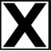
  - - <span style="color:green">Viele kleine günstige Panzer</span> 
    - <span style="color:green">Guter Anti-Tank-Tab</span> 
    &nbsp;
    - <span style="color:red">Zu wenig Slots - schwer auf Balanced</span>  
    - <span style="color:red">Schwache Infanterie (wenig CQC)</span>  
    - <span style="color:red">Sehr schwacher Support</span>  
    - <span style="color:red">Probleme gegen schwere Panzer</span>  
  - - **Konjicki Izvidaci**: Sehr gute 12-Mann Recon (4xBeretta+2xBreda(MG)+Molotov)
    - **Il-2M**: Sehr gute Bomber/AT-Flugzeuge (versch. Typen)
* - [Podv. Gruppa Bezuglogo](https://steeldivision.fandom.com/wiki/Podv._Gruppa_Bezuglogo)  
  - 
  - - <span style="color:green">Guter Panzer-Mix</span>  
    - <span style="color:green">Gute, günstige Infanterie</span>  
    - <span style="color:green">Gute Luftwaffe</span>  
    &nbsp;
    - <span style="color:red">Mittelmässige Anti-Tank</span>  
    - <span style="color:red">Schwache 2K</span>  
  - - **Razvedka**: Gute Recon (Bazooka Squad mit Exceptional Stealth)  
    - **Shtrafniki**: 20-Mann - beste Rifle Squad (2 Karten)
    - **T-6 Tigr**: Beutetiger (1 Karte)
    - <span style="color:DodgerBlue">**OB-25 76.2mm**: Bestes HE-Geschütz</span>
* - [15th Infantry](https://steeldivision.fandom.com/wiki/15th_Infantry_(SD2))  
  - 
  - - <span style="color:green">Gute gepanzerte Recon-Fahrzeuge</span>  
    - <span style="color:green">Guter Support-Tab</span>  
    - <span style="color:green">Sehr gute Luftwaffe</span>  
    &nbsp;
    - <span style="color:red">Schwache Infanterie (schlechte Rifles)</span>  
    - <span style="color:red">Alle Panzer sehr langsam (nur Churchills)</span>  
    - <span style="color:red">Sehr langsame Division</span>  
  - - **AEC Mk.3**: Gutes gepanzertes Fahrzeug (70 Penetration)
    - **Churchill IV**: Guter Tank-Killer (175 Pen, 12 r/m(!), nur 90 FA)
    - **Churchill V**: Gute 2K-HE
    - **Crusader AA Mk.1**: Sehr gute AA, Bofors auf Rädern. Auch gegen Infanterie
    - <span style="color:DodgerBlue">**Typhoon Mk.1B**: Bester Fighter/Fighter-Bomber im Spiel</span>
* - [3rd Canadian Infantry](https://steeldivision.fandom.com/wiki/3rd_Canadian_Infantry_(SD2))  
  - 
  - - <span style="color:green">Guter Anti-Tank-Tab</span>  
    - <span style="color:green">Gute Anti-Air und Luftwaffe</span>  
    &nbsp;
    - <span style="color:red">Mittelmässige Infanterie</span>  
    - <span style="color:red">Mittelmässige Artillerie</span>  
  - - <span style="color:DodgerBlue">**Kangaroo Rifles**: Sehr gutes 15-Mann Rifle Squad (4xSten+3Bren(MG)+Piat+Kangaroo Panzer) (2 Karten)</span>
    - **17-PDR 76.2mm**: Sehr gutes AT Geschütz (3 Karten)
    - **Firefly Vc**: Guter Tank-Killer (170mm Pen, 100mm FA) 
    - **Mosquito FB. VI**: Gute AT/Bomber-Flugzeuge
* - [3-ya Gvard. Mechanizi. Korpus](https://steeldivision.fandom.com/wiki/3-ya_Gvard._Mechanizi._Korpus)  
  - 
  - - <span style="color:green">Gute, günstige Infanterie</span>  
    - <span style="color:green">Akzeptabler Anti-Tank-Tab</span>  
    &nbsp;
    - <span style="color:red">Nur leichte und mittlere Panzer</span> 
    - <span style="color:red">Schwacher Support</span>  
    - <span style="color:red">Mittelmässige Artillerie</span>  
  - - **Razvedka**: Gute Recon (Bazooka Squad mit Exceptional Stealth)  
    - **Avtomatchiki**: Gute 10-Mann CQC (10xPPSH+Granate)
    - **OMSBON**: Guter Kommandant mit Sniper
* - [184-ya Strelkovy](https://steeldivision.fandom.com/wiki/184-ya_Strelkovy)  
  - 
  - - <span style="color:green">Gute, günstige Infanterie</span>  
    - <span style="color:green">Gute Artillerie und Luftwaffe</span>  
    &nbsp;
    - <span style="color:red">Schwache Panzer (nur leicht)</span>
    - <span style="color:red">Mittelmässiger Support</span>  
    - <span style="color:red">Mittelmässige Anti-Tank (viele ISU-122)</span>  
  - - **Snayperi Shanina**: Sniper Ace (10 r/m, 80% Accuracy)
    - **Avtomatchiki**: Gute 10-Mann CQC (10xPPSH+Granate) (4 Karten)
    - **IL-2M3**: Guter Bomber/AT-Rocket/Napalm-Bomber (Resilience: Sehr gut)
* - [Morskaya Gruppa Bakhtina](https://steeldivision.fandom.com/wiki/Morskaya_Gruppa_Bakhtina)  
  - 
  - - <span style="color:green">Sehr gute Recon und Infanterie</span>  
    - <span style="color:green">Gute Luftwaffe</span>  
    &nbsp;
    - <span style="color:red">Sehr wenig Panzer</span>  
    - <span style="color:red">Schwacher Support</span>  
    - <span style="color:red">Schwache Artillerie</span>  
  - - <span style="color:DodgerBlue">**Osnaz VMF**: Eines des besten Sniper-Squads (4xPPS41+Sniper+MG42)</span>
    - **Chernyie Bushlaty**: Gutes Rifle Squad (3xPPSh+8xSemiAuto+DP28(MG)+PTRQ)
    - **Morskaya Saperi**: Gute 12-Mann CQC (4xPPSh+2xMP40+TNT)
    - <span style="color:DodgerBlue">**Morskaya Avto.**: Sehr starke CQC (12xThompson+AT-Grenade)</span>
    - <span style="color:DodgerBlue">**Shtrafniki**: Sehr starkes 20-Mann Rifle Squad (3xPPSh+3xDP28(MG)+PTRD) (2 Karten)</span>
    - <span style="color:DodgerBlue">**GPA KAO (132 mm)**: Stärkste Off-Map-Artillerie im Spiel</span>
```  

&nbsp;

### *D-Tier*

```{list-table}
:header-rows: 1

* - Division
  - Wappen
  - Stärken / Schwächen
  - Anmerkungen
* - [19-y Tankovy Korpus](https://steeldivision.fandom.com/wiki/19-y_Tankovy_Korpus)  
  - 
  - - <span style="color:green">Guter Tank Tab (nur schwere Panzer)</span>  
    - <span style="color:green">Gute Artillerie</span>  
    &nbsp;
    - <span style="color:red">Schrecklicher Infanterie-Tab</span>  
    - <span style="color:red">Insgesamt schwer zu spielen</span>  
    - <span style="color:red">Schlechter Anti-Tank-Tab</span>  
  - - **Razvedka**: Gute Recon (Bazooka Squad mit Exceptional Stealth) (3 Karten)
    - **IS-2 obr.1943** (1 Karte) und **SU-152** (1 Karte)
    - **Yak-3 Zakharov**: Guter Fighter
* - [NOV](https://steeldivision.fandom.com/wiki/NOV)  
  - 
  - - <span style="color:green">Gute Luftwaffe</span>  
    &nbsp;
    - <span style="color:red">So gut wie keine Panzer</span>  
    - <span style="color:red">Schlechter Support und Anti-Tank</span>  
    - <span style="color:red">Schlechte Anti-Air und Artillerie</span>  
  - - Jugoslawische Partisanenarmee
    - **Konjicki Izvidaci**: Sehr gute 12-Mann Recon (4xBeretta+2xBreda(MG)+Molotov) (3 Karten)
    - **Bombasi**: Gute CQC (8xSemiAuto+TNT)
    - **Kommandir**: Guter 12-Mann Leader (4xSten+PIAT)
* - [7. Eesti Laskurdiviis](https://steeldivision.fandom.com/wiki/7._Eesti_Laskurdiviis)  
  - 
  - - <span style="color:green">Brauchbare Luftwaffe</span>  
    &nbsp;
    - <span style="color:red">Mittelmässige Infanterie und Support</span>  
    - <span style="color:red">Nur Medium Panzer, große Probleme gegen schwere Panzer</span>  
    - <span style="color:red">Keine brauchbare Anti-Tank</span>  
  - - **Mustad Mantlid**: 15-Mann Rifle Squad für nur 20 Punkte
    - **IL-2M3 AP Cluster**: Guter Bomber
* - [3-ya VDV](https://steeldivision.fandom.com/wiki/3-ya_VDV)  
  - 
  - - <span style="color:green">Gute und günstige Infanterie</span>  
    - <span style="color:green">Gute Anti-Tank</span>  
    &nbsp;
    - <span style="color:red">Nur Medium Panzer (T34/76 1942+1943)</span>
  - - **Shturmoviki (Roks)**: Sehr gute CQC (6xPPSh+2xFlammenwerfer) (2 Karten)
    - **Desantniki**: Gute und günstige CQC (8xPPSh+AT-Granate)
    - **IL-2M3**: Guter Bomber/AT-Rocket/Napalm-Bomber (Resilience: Sehr gut)
```  